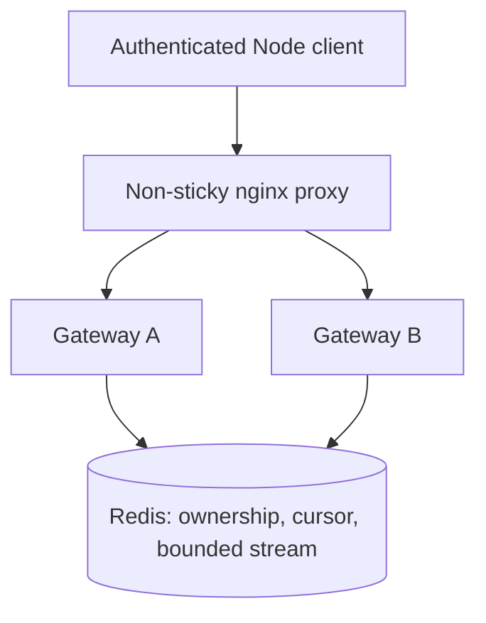

# Resilient WebSocket Gateway

Two Node.js/TypeScript gateways share session state in Redis so a client can reconnect on another instance and replay available events after a process dies.

## The problem

HTTP setup may reach one instance while a later WebSocket attachment reaches another. Keeping session state only in the first process breaks that connection. Losing a connected process creates the same problem again.

This independent portfolio experiment makes those failures reproducible: authenticated ownership, per-session event ordering, bounded replay and explicit failure responses. It contains no employer code or architecture.

## Architecture



## Try the failure scenario

Requires Node 24+, Docker Engine/Desktop with Compose, and free loopback ports 8080–8083 and 6387.

```sh
npm ci
npm run demo:failover
```

The command generates an ignored local credential, builds/starts the stack, connects through the proxy, receives cursor 1, **kills the connected gateway with SIGKILL**, publishes cursor 2 on the survivor, reconnects through the proxy and verifies replay. It restarts the killed gateway afterward. Shut the stack down with `npm run stack:down`; Redis data is retained in its named Docker volume.

## Delivery semantics

- One ordered integer cursor per session, assigned atomically in Redis.
- Replay covers the newest 100 events and at most 60 seconds. Sessions expire after ten minutes.
- A missing history range fails explicitly; no silent skip to the newest cursor.
- Replay can duplicate processed events. Clients deduplicate using their processed cursor.

[Exact boundaries and tradeoffs](docs/replay-semantics.md). There is no exactly-once or database failover guarantee.

## Tests

```sh
npm run lint
npm run typecheck
npm test
npm run stack:up
npm run test:integration
npm run build
```

[Integration tests](tests/integration.test.ts) use actual Redis and Docker containers. They cover cross-instance setup, concurrent ordered publication, reconnect/replay, forged identity and wrong-owner denial, count/age replay gaps, session expiry, concurrent owner isolation, SIGKILL recovery through the proxy, SIGTERM shutdown, Redis outages and a paused TCP reader. These destructive tests belong to this named local Compose stack; run them separately from load tests.

[Authentication/cursor tests](tests/unit.test.ts) check signature, expiry and malformed cursors. [CI](.github/workflows/ci.yml) runs static checks, both test suites and the build on Linux.

## Observability

Each gateway exposes `/metrics` on its direct port. During failover, inspect `websocket_connections_current`, `websocket_connections_total`, `replayed_events_total`, and `websocket_failures_total{reason}`. Redis operation duration includes failed attempts. Standard Node metrics report event-loop lag, memory and CPU.

There are no user/session/URL labels. The connection metric is local to each process; scrape both gateways, since the proxy may route successive scrapes differently.

## Reproducible load test

```sh
npm run stack:up
npm run load
```

[Measured results and method](docs/benchmark.md) cover 10, 50, 100 and 250 concurrent clients. The script measures delivery latency, observed throughput, errors, event-loop lag and replay recovery after killing A. Results describe this local workload; they are not a supported-user capacity claim.

## Read the implementation

[HTTP / WebSocket boundary](src/gateway.ts) · [Redis scripts](src/store.ts) · [Identity verification](src/auth.ts)

[Shared state and failure behavior](docs/shared-state.md) · [Backpressure](docs/backpressure.md)

## Local development

`npm run stack:up` creates `.env` only if missing. Do not commit it. The test/demo scripts issue local identities in memory and do not print tokens. A non-Docker gateway needs `AUTH_SECRET` (at least 32 characters), `REDIS_URL`, and optionally `PORT`/`INSTANCE`, then `node dist/src/main.js` after building.

This is a receive-only socket API. Authenticated clients publish through `POST /sessions/:id/events` with `{ "data": "text" }`; Node socket clients attach to `/sessions/:id/ws?cursor=0` with an Authorization header. Owner fields are ignored. Session IDs and cursors are returned by `POST /sessions` and event publication respectively.

## Limitations

Educational portfolio demonstration. One Redis instance, bounded history, polling overhead, no browser credential exchange, no per-owner quotas, no durable publication idempotency and no deployment TLS. Redis AOF can lose recently acknowledged events if Redis itself crashes. Unknown HTTP write outcomes require application-level reconciliation. See the notes before treating this as a deployment starting point.
